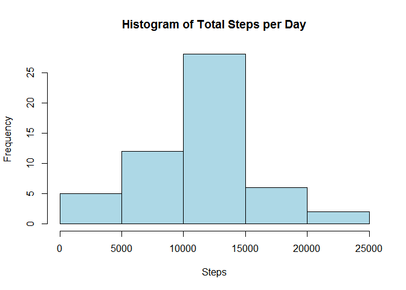
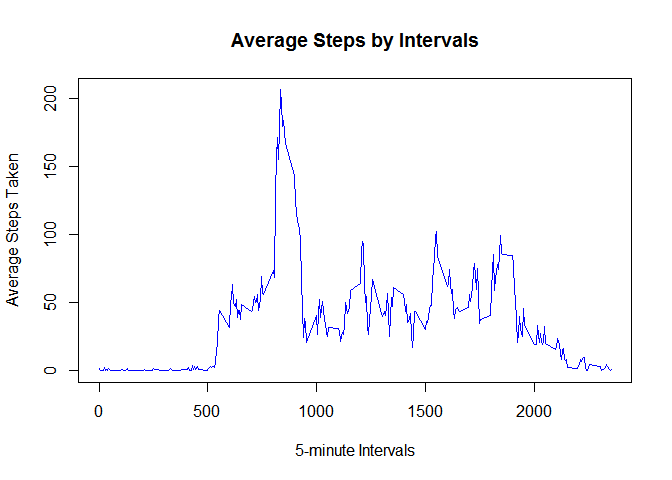
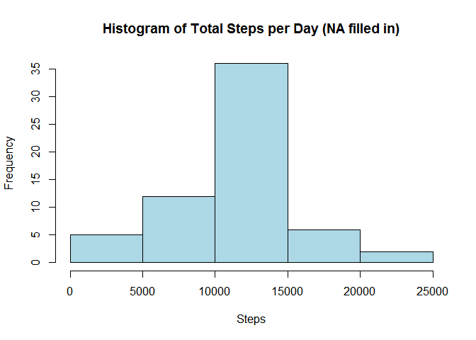
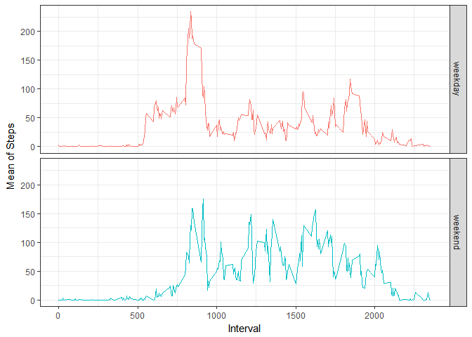

```r
library(dplyr)
library(ggplot2)
```

## Loading and preprocessing the data

The source data is in the forked repository. it is named as "activity.zip"; Unzip the file, and read the raw data set into *ds*.


```r
unzip("activity.zip")
ds<-read.csv("activity.csv",quote="\"",na.strings="NA")
```
Examime *ds* to get a brief overview about the source data structure:


```r
head(ds)
```

```
##   steps       date interval
## 1    NA 2012-10-01        0
## 2    NA 2012-10-01        5
## 3    NA 2012-10-01       10
## 4    NA 2012-10-01       15
## 5    NA 2012-10-01       20
## 6    NA 2012-10-01       25
```

```r
dim(ds)
```

```
## [1] 17568     3
```

```r
str(ds)
```

```
## 'data.frame':	17568 obs. of  3 variables:
##  $ steps   : int  NA NA NA NA NA NA NA NA NA NA ...
##  $ date    : Factor w/ 61 levels "2012-10-01","2012-10-02",..: 1 1 1 1 1 1 1 1 1 1 ...
##  $ interval: int  0 5 10 15 20 25 30 35 40 45 ...
```
The "date" column is of factor type. In order to make following steps easier, change the data type to "Date":


```r
ds<-transform(ds, date=as.Date(date))
str(ds)
```

```
## 'data.frame':	17568 obs. of  3 variables:
##  $ steps   : int  NA NA NA NA NA NA NA NA NA NA ...
##  $ date    : Date, format: "2012-10-01" "2012-10-01" ...
##  $ interval: int  0 5 10 15 20 25 30 35 40 45 ...
```

```r
head(ds)
```

```
##   steps       date interval
## 1    NA 2012-10-01        0
## 2    NA 2012-10-01        5
## 3    NA 2012-10-01       10
## 4    NA 2012-10-01       15
## 5    NA 2012-10-01       20
## 6    NA 2012-10-01       25
```


## What is mean total mumber of steps taken per day?
We ignore the missing values in the dataset.

1. Calsuclate the total number of steps taken per day, assign the result to *Daily*:

```r
Daily<-ds %>% group_by(date) %>% summarize(TotalSteps=sum(steps))
Daily
```

```
## # A tibble: 61 x 2
##    date       TotalSteps
##    <date>          <int>
##  1 2012-10-01         NA
##  2 2012-10-02        126
##  3 2012-10-03      11352
##  4 2012-10-04      12116
##  5 2012-10-05      13294
##  6 2012-10-06      15420
##  7 2012-10-07      11015
##  8 2012-10-08         NA
##  9 2012-10-09      12811
## 10 2012-10-10       9900
## # ... with 51 more rows
```
2. Make a histogram of the total number of steps taken each day:

```r
hist(Daily$TotalSteps, col="lightblue", xlab="Steps", main="Histogram of Total Steps per Day")
```

<!-- -->

3. Calculate and report the mean and median of daily total steps taken:

```r
mean_steps<-round(mean(Daily$TotalSteps, na.rm = T),digits = 2)
median_steps<-median(Daily$TotalSteps, na.rm = T)
```
So, the **mean** of daily steps taken is 10766.19 and **median** is 10765.

## What is the average daily activity pattern?
1. Make a time series plot (i.e.type="l") of the 5-minute interval (x-axis) and the average number of steps taken, averaged across all days (y-axis)

```r
TimeSeries<-ds %>% group_by(interval) %>% summarize(AvgSteps=mean(steps, na.rm=T))
plot(TimeSeries$interval, TimeSeries$AvgSteps, type="l", main="Average Steps by Intervals", xlab="5-minute Intervals", ylab="Average Steps Taken", col="blue")
```

<!-- -->

2. Which 5-minute interval, on average across all the days in the dataset, contains the maximum number of steps?

```r
interval<-TimeSeries$interval[which.max(TimeSeries$AvgSteps)]
maxAvg<-round(max(TimeSeries$AvgSteps), digits = 2)
```
5-minute interval **835** has maximum number of average steps (**206.17**).

## Imputing missing Values
There are a number of days/intervals where there are missing values (coded as NA). The presence of missing days may introduce bias into some calculations or summaries of the data.

1. Calculate and report the total number of missing values in the dataset (i.e. the total number of rows with NAs)

```r
missings<-sum(is.na(ds$steps))
```
There are **2304** missing values in the dataset.

2. Devise a strategy for filling in all of the missing values in the dataset. The strategy does not need to be sophisticated. For example, you could use the mean/median for that day, or the mean for that 5-minute interval, etc.

Stragegy chosen: Use average steps of an interval (calculated previously) for filling in all of the missing values for the same interval in the dataset. 

3. Create a new dataset *ds_filled* that is equal to the original dataset but with the missing data filled in.

```r
ds_filled<-merge(ds, TimeSeries,by="interval" )
ds_filled$steps[is.na(ds_filled$steps)]<-ds_filled$AvgSteps[is.na(ds_filled$steps)]
```

4. Make a histogram of the total number of steps taken each day: 

```r
summary_filled<-group_by(ds_filled,date) %>% summarize(Steps_Total=sum(steps), Steps_Mean=mean(steps), Steps_Median=median(steps))
hist(summary_filled$Steps_Total, main="Histogram of Total Steps per Day (NA filled in)", xlab="Steps", col="lightblue")
```

<!-- -->

Calculate and report the mean and median total number of steps taken per day:

```r
mean_filled<-round(mean(summary_filled$Steps_Total, na.rm = T), digits = 2)
median_filled<-round(median(summary_filled$Steps_Total, na.rm = T),digits=2)
```
The mean and median of total number of steps taken per day in the dataset with imputing missing values are **10766.19** and **10766.19**; The mean and median of original dataset are **10766.19** and **10765** (calculated in part 2, item 3). So, there are not much difference in mean and median between the original dataset and the imputed dataset, i.e. they are almost the same.

What is the impact of imputing missing data on the estimates of the total daily number of steps?
The median in the NA imputing dateset become closer to the mean, which is the same between the original and NA imputing datasets.


## Are there differences in activity patterns between weekdays and weekends?
1. create a new factor variable *DayType* in the dataset with two levels - "weekday" and "weekend" indicating whether a given date is a weekday or weekend day.

```r
ds$DayType<-ifelse(weekdays(ds$date) %in% c("Saturday", "Sunday"), "weekend","weekday")
```

2. Make a panel plot containing a time series plot (i.e. type="l") of the 5-minute interval (x-axis) and the average number of steps taken, averaged across all weekdays or weekend days (y-axis).

```r
result<-group_by(ds, DayType=as.factor(DayType), interval) %>% summarize(Steps_Mean=mean(steps, na.rm = T))
g<-ggplot(result, aes(x=interval, y=Steps_Mean,color=DayType)) + geom_line() + facet_grid(DayType ~ .) +theme_bw()+theme(legend.position = "none")+xlab("Interval")+ylab("Mean of Steps")
g
```

<!-- -->

From the comparison of the weekday and weekend graphs, we can see, during the weekends, people are less active (less steps) during the eariler time(from 0 to 1000 intervals), and more active later (after 10000).
